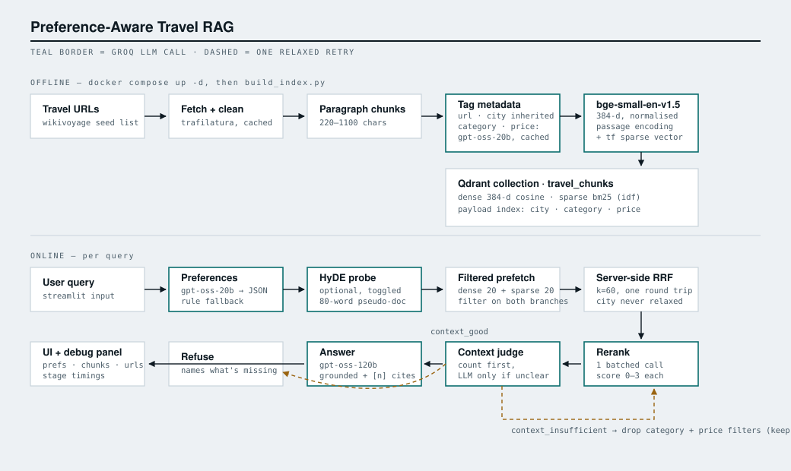

# Preference-Aware Travel RAG Assistant

Answers travel questions like *"3-day Berlin trip with cheap food and art"* from a small
indexed corpus of travel pages — and shows its working at every step.

```
query → preferences → filtered hybrid retrieval → rerank → context judge → grounded answer
```

Groq for every LLM call. BGE-small for embeddings. Qdrant for retrieval — dense and sparse
vectors in one collection, filtered and fused server-side. Streamlit for the UI.



---

## Quick start

Everything runs in Docker

```bash
git clone <your-repo-url> && cd travel-rag

cp .env.example .env            # paste your key from https://console.groq.com/keys
# leave QDRANT_API_KEY blank — local Qdrant runs without one

docker compose up -d --build    # Qdrant + the UI; first build is a few minutes (torch)
docker compose ps               # wait for both qdrant and app to say (healthy)

docker compose run --rm builder --from-corpus   # ~2 min
```

Open http://localhost:8501.

The collection lives in a Docker named volume, not under `data/` — `docker volume ls` will
show it, alongside `travel-rag_model_cache`, which holds the downloaded embedding models
so they aren't re-fetched on every container start. `docker compose down` stops everything
and keeps both volumes; `docker compose down -v` deletes them — the next `builder` run
rebuilds the collection from `data/corpus.jsonl` in about two minutes and re-downloads
~130 MB of model weights. Nothing irreplaceable is in there.

**Editing code:** `docker compose up` bind-mounts the whole repo root read-only over
the built image (via `docker-compose.override.yml`, which explains why it's the whole
tree and not a file at a time), so changes are picked up live — Streamlit reruns on
save. `./data` stays read-write, nested inside that mount.
`docker compose -f docker-compose.yml up` (explicitly skipping the override) runs the
baked image standalone, the way it would ship.

---

## Design decisions

### Embedding model — `BAAI/bge-small-en-v1.5`

- **384 dimensions, ~33M params, ~130 MB.** Runs on CPU in a fraction of a second per
  batch, which matters when the whole thing has to survive a laptop demo without a GPU.
- **Punches above its size on retrieval specifically.** It sits near the top of the MTEB
  retrieval band for its parameter count — better than `all-MiniLM-L6-v2` at the same
  latency, and it isn't a general-purpose sentence-similarity model repurposed for search.
- **Asymmetric by design.** BGE was trained with an instruction prefix on the query side
  only, which fits the RAG shape exactly: short question, long passage. `embed_query()`
  and `embed_passages()` are separate functions in `src/embedder.py` for this reason —
  applying the prefix to passages, or forgetting it on queries, is a silent recall hit
  that no test catches.
- **Apache 2.0, fully local.** No second API dependency, no per-query embedding cost.

The obvious upgrade is `bge-base` or `e5-large`. For ~3,000 chunks the ceiling here is
chunking quality and reranking, not embedding capacity, so the extra 4× latency buys very
little.

### Retrieval — hybrid dense + sparse, fused with RRF

Dense retrieval alone loses on travel queries, because travel queries are full of proper
nouns. "Pergamonmuseum", "Markthalle Neun", "Tempelhofer Feld" — a 384-dim embedding
smears all three into a generic "place in Berlin" region of the space. The sparse side
matches them exactly. Meanwhile sparse search alone is useless on "somewhere atmospheric
for a rainy afternoon", which has no keyword overlap with anything.

The two are combined with **reciprocal rank fusion** rather than score averaging, because
dense search returns cosine in [0, 1] and the sparse side returns unbounded IDF-weighted
term scores — those aren't on the same scale, and normalising them per query is a fudge
that quietly changes ranking depending on how good the best hit happened to be. RRF only
looks at rank position, so the mismatch never arises.

Fusion now happens **inside Qdrant**: two prefetches — one against the dense vector, one
against the sparse — each carrying the same payload filter, fused by the server with
`k=60`. That `k` is the same constant that used to live in `retrieve.py`, passed through
rather than replaced, so the arithmetic is unchanged even though the location isn't. The
filter goes on each prefetch and not on the outer query, which is the whole point: a
filter on the outer query would run after fusion and reinvent the post-filter this
migration existed to delete.

**HyDE** is available behind a UI toggle: one fast call writes a hypothetical guide
paragraph, and the dense side searches with `query + hypothetical` instead of the bare
query. It measurably helps vague queries and does roughly nothing for specific ones, so
it's optional rather than baked in. The sparse side always uses the real query —
searching lexically over invented text is a good way to retrieve invented places.

### Reranking

One batched LLM call scores all candidates 0–3, rather than N calls scoring one each.
Cheaper, faster, and the model ranks better when it can compare candidates side by side.
Ties break on fusion score, so retrieval rank still carries information inside a score band.

### Context judge

The reranker has already produced per-chunk relevance scores, so the gate is mostly just
counting them: ≥3 chunks scoring 2+ means proceed, 0 means stop. The LLM judge is only
invoked in the ambiguous middle (1–2 strong chunks). That keeps the check at roughly zero
extra calls on good queries.

On `context_insufficient`, the pipeline relaxes **category and price** filters, forces
HyDE on, and retries exactly once. **The city filter is never relaxed** — confidently
recommending a Prague restaurant to someone asking about Berlin is worse than admitting
the corpus doesn't cover it. If the retry also fails, it refuses, says what's missing, and suggests a question it
*can* answer — the refusal prompt is handed the indexed city list, so it can't
cheerfully propose another question about a city that isn't in the corpus.

---

## Repo layout

```
config.py                 all tunable knobs — models, k values, thresholds, Qdrant
Dockerfile                one image, shared by the app service and both jobs
.dockerignore
docker-compose.yml        qdrant + app service + two profile-gated jobs (builder, ask)
docker-compose.override.yml   dev-only whole-tree bind-mount for live reload (auto-loaded)
scripts/build_index.py    one-shot: fetch → chunk → embed → upsert
scripts/ask.py            one-shot: query the pipeline from the CLI
src/
  sources.py              the seed URLs + their source-level metadata
  ingest.py               fetch, clean, paragraph-chunk, LLM-tag (cached; keyword fallback)
  embedder.py             BGE wrapper, query/passage paths kept separate
  store.py                Qdrant client, collection schema, payload filters
  llm.py                  the only place a Groq call is made
  preferences.py          query → preferences JSON (LLM + rule fallback)
  retrieve.py             HyDE, dense+sparse prefetch, server-side RRF and filtering
  rerank.py               batched LLM reranker
  judge.py                context sufficiency gate
  generate.py             grounded answer / grounded refusal
  pipeline.py             orchestration + the trace the UI renders
app.py                    Streamlit UI
docs/architecture.svg     the diagram above
```
