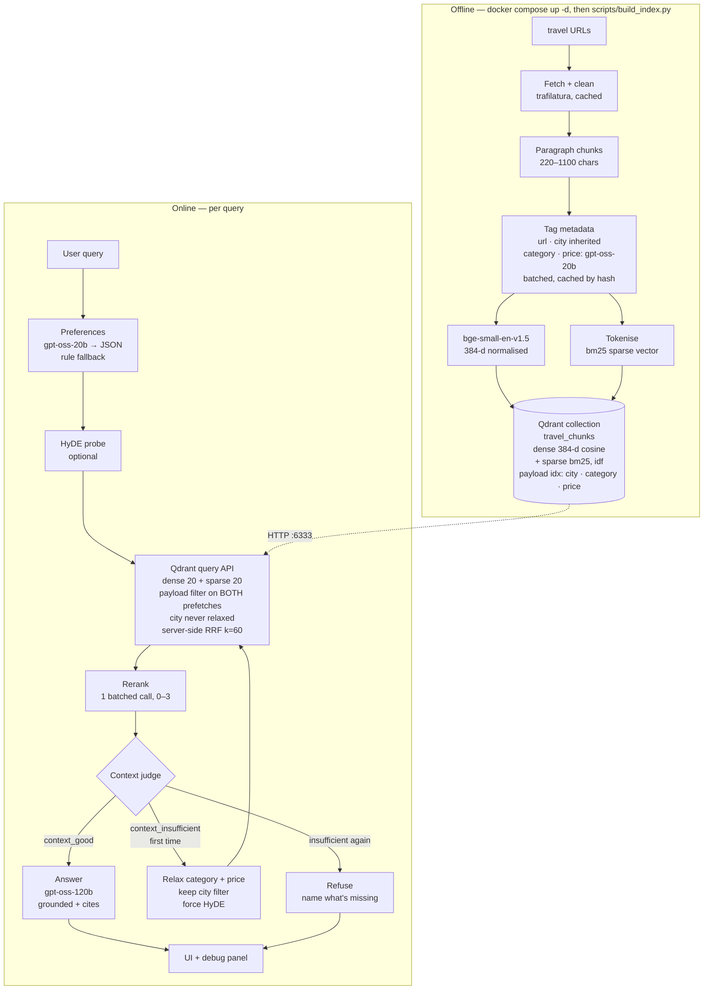

# Architecture (Mermaid source)

Rendered version: [architecture.svg](architecture.svg)

```mermaid
flowchart TB
  subgraph OFFLINE["Offline — docker compose up -d, then scripts/build_index.py"]
    U[travel URLs] --> F[Fetch + clean<br/>trafilatura, cached]
    F --> C[Paragraph chunks<br/>220–1100 chars]
    C --> M[Tag metadata<br/>url · city inherited<br/>category · price: gpt-oss-20b<br/>batched, cached by hash]
    M --> E[bge-small-en-v1.5<br/>384-d normalised]
    M --> B[Tokenise<br/>bm25 sparse vector]
    E --> IDX[(Qdrant collection<br/>travel_chunks<br/>dense 384-d cosine<br/>+ sparse bm25, idf<br/>payload idx: city · category · price)]
    B --> IDX
  end

  subgraph ONLINE["Online — per query"]
    Q[User query] --> P[Preferences<br/>gpt-oss-20b → JSON<br/>rule fallback]
    P --> H[HyDE probe<br/>optional]
    H --> S[Qdrant query API<br/>dense 20 + sparse 20<br/>payload filter on BOTH prefetches<br/>city never relaxed<br/>server-side RRF k=60]
    S --> RR[Rerank<br/>1 batched call, 0–3]
    RR --> J{Context judge}
    J -->|context_good| A[Answer<br/>gpt-oss-120b<br/>grounded + cites]
    J -->|context_insufficient<br/>first time| RELAX[Relax category + price<br/>keep city filter<br/>force HyDE] --> S
    J -->|insufficient again| REF[Refuse<br/>name what's missing]
    A --> UI[UI + debug panel]
    REF --> UI
  end

  IDX -.->|"HTTP :6333"| S
```
